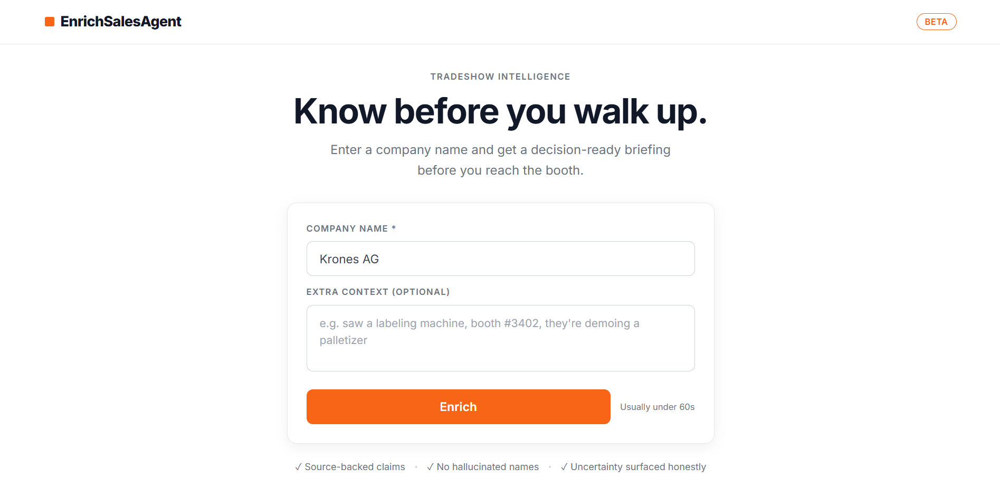
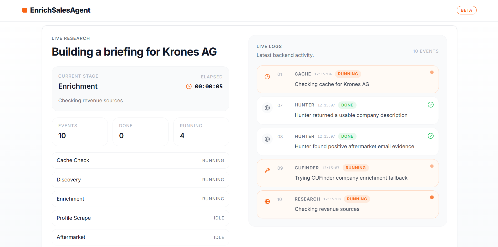
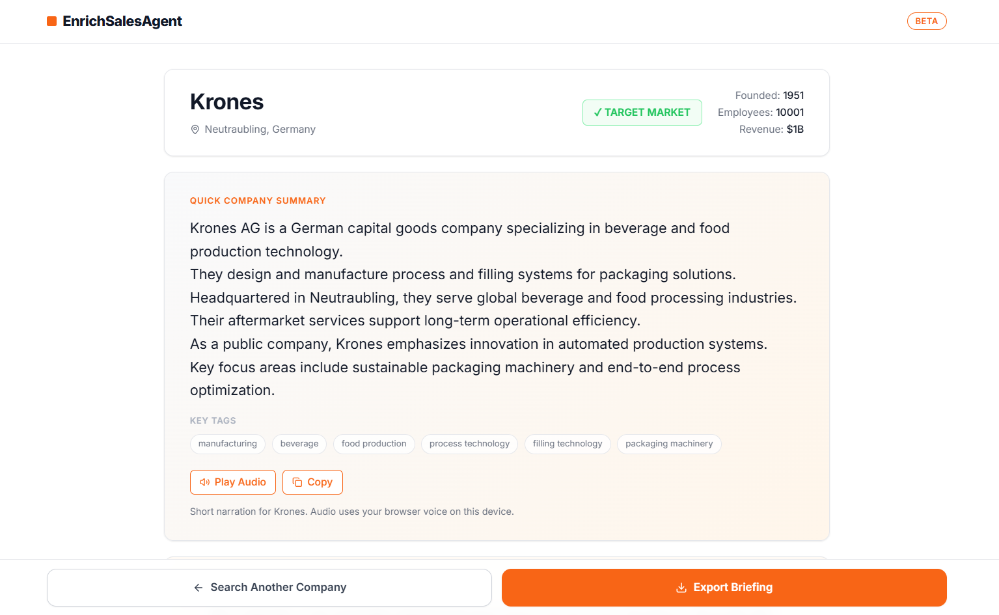
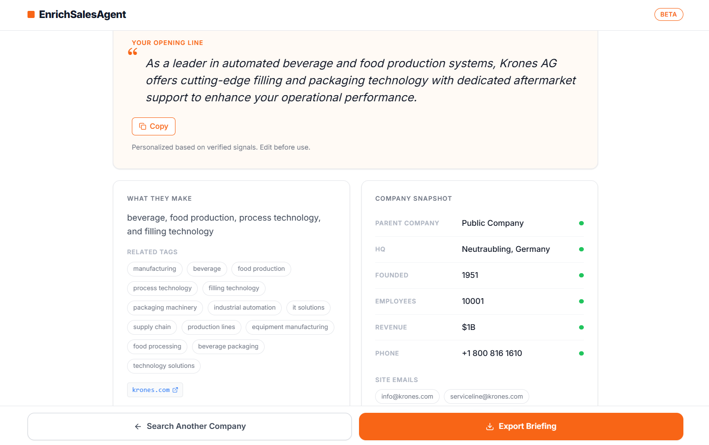
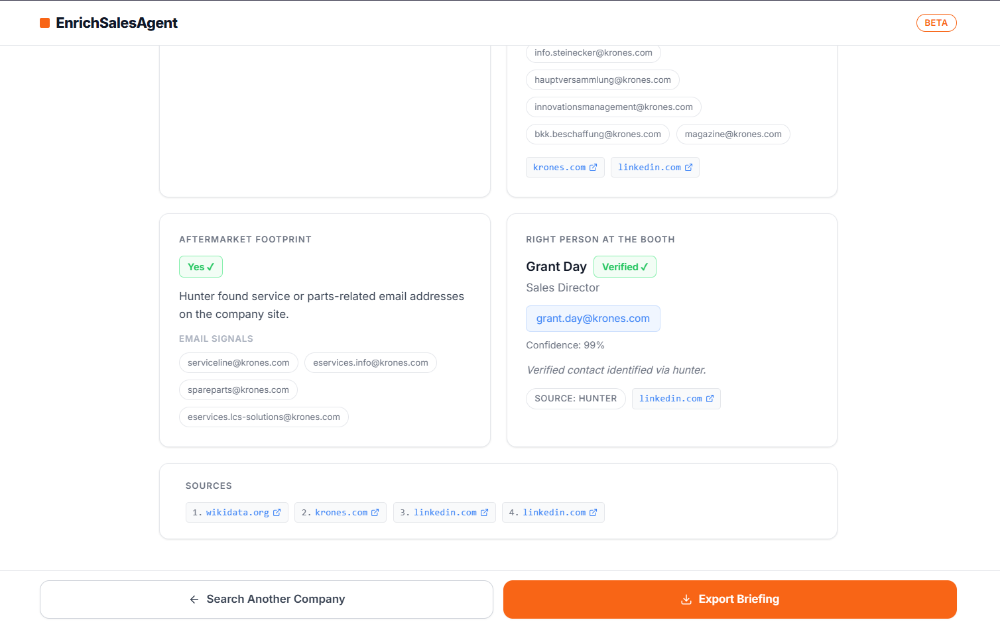

# EnrichSalesAgent

EnrichSalesAgent is a research pipeline for industrial-tradeshow outreach. Give it a company name and optional booth context, and it returns a source-backed research brief with company facts, aftermarket clues, target-contact guidance, a structured company summary, and an opening line.

The frontend is intentionally light. The core value of this repo is the backend orchestration flow: domain discovery, enrichment, scraping, aftermarket detection, people targeting, source attribution, and response caching.

## Screenshots

Place these images in `docs/images/` so they render automatically in GitHub:

### 1. Front Page



### 2. Live Logs



### 3. Research Card 1



### 4. Research Card 2



### 5. Research Card 3



## Backend Pipeline

The backend pipeline diagram should also live in `docs/images/`:


The backend README also references the same file, so you only need to keep one copy in the repo.

## What This Project Does

- Resolves the official company domain from a company name.
- Pulls structured company data from multiple enrichment sources.
- Scrapes website/about-page content when enrichment providers leave gaps.
- Detects aftermarket, service, support, and portal signals.
- Finds the best booth-contact person or a fallback target title.
- Generates a structured 5 to 6 line company summary using company facts, tags, geography, and aftermarket context.
- Supports browser-based TTS playback for the company summary on the frontend.
- Generates a personalized opening line.
- Returns field-level provenance and source URLs.
- Streams progress events to the frontend while the backend is running.
- Uses a two-stage SQLite cache to speed up repeated lookups and alias lookups that resolve to the same domain.

## Live App

Frontend:
`https://enrichsalesagent.vercel.app/`

## End-to-End Flow

1. The user submits `company_name` and optional `extra_context`.
2. The frontend calls `POST /research/stream`.
3. FastAPI starts the orchestration flow in `server/app/services/synthesizer.py`.
4. The backend emits progress events as NDJSON while work is happening.
5. Discovery resolves the domain and pulls Wikidata fallback metadata.
6. Enrichment gathers company fields from Hunter first, then fallback providers.
7. Scraping fills gaps in `description` or `what_they_make` when needed.
8. Aftermarket detection looks for service, parts, support, and portal clues.
9. People targeting finds a real person or the best fallback title.
10. Messaging generation produces a structured company summary and a personalized outreach opener.
11. The frontend can play the summary back using browser TTS controls.
12. The final response is returned with `data`, `field_sources`, `sources`, and `notes`.
13. The completed response is cached by both input alias and resolved domain for future requests.

## Backend Architecture

### API layer

Files:
- `server/app/main.py`
- `server/app/routes.py`
- `server/app/models.py`

Responsibilities:
- boot the FastAPI app
- define `/research` and `/research/stream`
- validate request and response payloads
- expose streaming progress events to the frontend

### Orchestration layer

File:
- `server/app/services/synthesizer.py`

Responsibilities:
- run the full research pipeline
- manage stage timings
- emit progress events
- merge multi-source data into one normalized response
- preserve source attribution
- store and retrieve both input-key and domain-key cached results

### Service layers

- `discovery.py`
  Resolves the domain and gathers structured Wikidata fallbacks.
- `enrichment.py`
  Uses Hunter first, then Technology Checker and CUFinder when needed.
- `scraper.py`
  Pulls website/about-page content and extracts fallback facts.
- `aftermarket.py`
  Detects service, parts, support, and portal signals.
- `people.py`
  Finds the best person or fallback title for outreach.
- `geography.py`
  Classifies HQ geography deterministically from country data.
- `news.py`
  Supports recent-signal collection when used in the research response.

## Parallel vs Sequential Work

The backend is optimized around a simple orchestration model.

### Parallel block

After discovery, the backend can run these branches in parallel when needed:

- company enrichment
- website/about-page scraping
- aftermarket detection

This is coordinated with `asyncio.gather(...)`.

### Sequential block

After the parallel block completes, the backend runs:

- people targeting
- `what_they_make` backfill
- opening-line generation

This keeps downstream logic deterministic and lets later steps use earlier evidence.

## API Surface

### `POST /research`

Returns a full `ResearchResponse` once the pipeline finishes.

### `POST /research/stream`

Streams NDJSON progress events and ends with a final result payload.

Typical stream event types:

- `progress`
- `result`
- `error`

## Cache Strategy

The backend now uses a two-stage cache:

1. Input cache
   Keyed by normalized `company_name + extra_context + requested_fields`
2. Domain cache
   Keyed by normalized `resolved_domain + extra_context + requested_fields`

Flow:

1. Check the input cache before discovery.
2. If that misses, run discovery and resolve the domain.
3. Check the domain cache after discovery.
4. If the domain cache hits, reuse that result and backfill the input cache alias.
5. If both miss, run live research and store the final result in both caches.

This helps with cases like `Bobst` vs `Bobst Group` when both names resolve to the same website.

## Response Shape

The final response includes:

- `company_name`
- `resolved_domain`
- `data`
- `field_sources`
- `sources`
- `notes`

The important design choice here is that each major field can be traced back to the source that produced it.

## Why The Backend Matters Most

The frontend is mostly a simple operator surface:

- input form
- loading/logs view
- final briefing card with summary audio playback

The hard part of the product lives in the backend:

- provider ordering
- fallback rules
- not overwriting stronger evidence with weaker evidence
- surfacing uncertainty honestly
- caching expensive research
- keeping source provenance visible

## Repo Structure

```text
EnrichSalesAgent/
├─ README.md
├─ docs/
│  └─ images/
├─ client/
│  ├─ src/
│  └─ README.md
└─ server/
   ├─ README.md
   └─ app/
      ├─ routes.py
      ├─ models.py
      ├─ cache/
      ├─ llms/
      ├─ prompts/
      └─ services/
```

## Running Locally

### Backend

From `server/`:

```powershell
python -m venv .venv
.venv\Scripts\activate
pip install -r requirements.txt
uvicorn app.main:app --reload
```

Backend URL:

```text
http://127.0.0.1:8000
```

### Frontend

From `client/`:

```powershell
npm install
npm run dev
```

Frontend URL:

```text
http://localhost:8080
```

## Image Placement

Put all README images here:

```text
docs/images/front-page.png
docs/images/live-logs.png
docs/images/img1.png
docs/images/img2.png
docs/images/img3.png
docs/images/backend-pipeline.png
```

Using one shared `docs/images/` folder is the safest option for GitHub rendering because:

- root `README.md` can reference images with `docs/images/...`
- `server/README.md` can reference the same images with `../docs/images/...`
- all images stay versioned in one place

## More Detail

- Root project overview: `README.md`
- Frontend notes: `client/README.md`
- Backend architecture and service details: `server/README.md`
