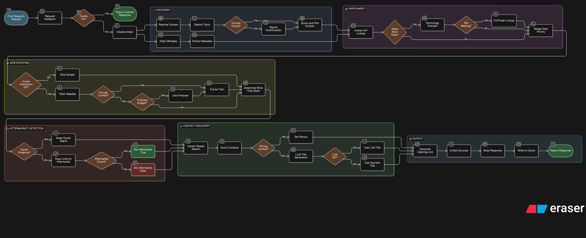

# Sales Agent Server

Backend service for company research and outreach enrichment.

This server accepts a company name, discovers the official domain, enriches company attributes from multiple sources, detects aftermarket/service signals, suggests the best target person or title, and generates a personalized opening line for outreach.

## Pipeline Diagram

Store the pipeline image here:

```text
docs/images/backend-pipeline.png
```

GitHub-rendered image:



## Folder Structure

```text
server/
├─ .env
├─ .env.example
├─ main.py
├─ pyproject.toml
├─ requirements.txt
├─ README.md
└─ app/
   ├─ __init__.py
   ├─ cache/
   │  ├─ __init__.py
   │  └─ sqlite_cache.py
   ├─ config.py
   ├─ main.py
   ├─ models.py
   ├─ routes.py
   ├─ llms/
   │  ├─ __init__.py
   │  └─ clients.py
   ├─ prompts/
   │  ├─ __init__.py
   │  ├─ enrichment.py
   │  ├─ people.py
   │  ├─ scraper.py
   │  └─ synthesizer.py
   └─ services/
      ├─ __init__.py
      ├─ aftermarket.py
      ├─ discovery.py
      ├─ enrichment.py
      ├─ geography.py
      ├─ hunter.py
      ├─ news.py
      ├─ people.py
      ├─ scraper.py
      └─ synthesizer.py
```

## High-Level Flow

Request flow:

1. `POST /research` receives a company name.
2. `routes.py` forwards the request to `services/synthesizer.py`.
3. `synthesizer.py` orchestrates the full pipeline.
4. Each service returns data plus source attribution.
5. The final response contains:
   - normalized company data
   - field-level source mapping
   - source URLs
   - timing notes

## Layer-by-Layer Architecture

### 1. API Layer

Files:
- `app/main.py`
- `app/routes.py`
- `app/models.py`

Responsibilities:
- Starts the FastAPI app
- Configures CORS
- Exposes the `/research` endpoint
- Validates request and response payloads

### 2. Orchestration Layer

File:
- `app/services/synthesizer.py`

Responsibilities:
- Coordinates the entire research pipeline
- Runs discovery first
- Runs major enrichment services in parallel
- Runs people targeting and opening-line generation after enrichment
- Merges data from all sources
- Tracks field-level provenance and timings

### 3. Discovery Layer

File:
- `app/services/discovery.py`

Responsibilities:
- Resolves the official company domain
- Searches Wikidata for structured company metadata
- Extracts fields like:
  - `official_name`
  - `description`
  - `founded_year`
  - `hq_city`
  - `hq_country`
  - `industry`
  - `parent_company`
  - `website`

Fallback behavior:
- If domain search fails but Wikidata has a website, Wikidata is used as the domain fallback.
- If Wikidata description is too weak, search snippets may be used as a better description fallback.

### 4. Enrichment Layer

File:
- `app/services/enrichment.py`

Responsibilities:
- Pulls company metadata from external enrichment providers
- Uses Hunter first once a domain is resolved
- Uses Technology Checker as a secondary fallback source
- Uses CUFinder mainly as a revenue fallback, plus last-resort gap fill when needed
- Merges provider data into one normalized company profile

Key behavior:
- Hunter can provide:
  - `official_name`
  - `description`
  - `founded_year`
  - `hq_city`
  - `hq_country`
  - `industry`
  - `employee_count`
  - `company_linkedin_url`
  - `company_phone`
  - `company_tags`
  - `site_emails`
  - `aftermarket_site_emails`
- Hunter is now the first-priority enrichment source for most company profile fields
- If Hunter returns a usable `description`, that description is kept and scraper/Wikidata only act as fallback
- If Hunter returns positive aftermarket evidence such as service or spare-parts emails, that positive signal is preserved
- CUFinder is still used when `revenue` is missing after Hunter and other sources
- Technology Checker description is shortened before merge
- Wikidata remains a structured fallback when enrichment providers are missing data

Primary sources:
- Hunter
- Technology Checker
- CUFinder revenue fallback
- Wikidata fallback

### 5. Website Scraping Layer

File:
- `app/services/scraper.py`

Responsibilities:
- Fetches homepage/about content
- Extracts:
  - `what_they_make`
  - `description`
  - `source_url`
  - `fetch_method`

Behavior:
- Direct HTML fetch is tried first
- Firecrawl is used only if direct fetch is too weak
- LLM is used only when regex extraction and factual fallback are not enough
- Website description is used only when Hunter did not already provide a usable description

Description rules:
- Hunter description has first priority when present and non-weak
- If description comes from LLM, it is kept very short
- If description comes from website text, it is capped at 3 to 4 sentences max

### 6. Aftermarket Detection Layer

File:
- `app/services/aftermarket.py`

Responsibilities:
- Detects whether the company shows aftermarket/service/parts/support signals

Current behavior:
- If Hunter already found positive aftermarket evidence, the detector does not overwrite it with `false`
- Uses first-clue mode
- Stops once one strong clue is found
- Returns only one main aftermarket signal instead of building a full aftermarket map

Fast path:
- Homepage link scan
- Common path probing such as `/parts`, `/service`, `/support`

Fallback path:
- Sitemap scan only if the fast checks found nothing useful

### 7. People Targeting Layer

File:
- `app/services/people.py`

Responsibilities:
- Finds the most relevant person or fallback title

Behavior:
- Hunter is tried first for real contacts
- Hunter people scoring now prefers aftermarket, parts, service, field-service, commercial, and business-development roles
- Hunter people scoring penalizes misleading non-owner roles such as IT or `ServiceNow` titles
- If no real person is found, the service suggests the best title based on:
  - aftermarket clues
  - employee count
  - company context

Outputs include:
- `target_person_name`
- `target_person_title`
- `target_person_linkedin_url`
- `target_person_email`
- `target_person_confidence`
- `target_person_source`
- `suggested_target_title`
- `suggested_target_title_reasoning`

### 8. Geography Layer

File:
- `app/services/geography.py`

Responsibilities:
- Classifies HQ geography using only `hq_country`
- Keeps the logic simple and deterministic
- Adds no extra network calls or LLM calls

Outputs:
- `hq_geography_flag`
- `hq_geography_region`
- `hq_geography_reason`

Current behavior:
- `North America`, `Europe`, and `Japan` are treated as target markets
- `China` is treated as a flagged market
- everything else becomes `non_target_market`
- missing `hq_country` becomes `unknown`

### 9. Prompt Layer

Folder:
- `app/prompts/`

Responsibilities:
- Stores prompt text separately from service logic
- Keeps prompt management centralized

Files:
- `prompts/enrichment.py`
- `prompts/people.py`
- `prompts/scraper.py`
- `prompts/synthesizer.py`

### 10. LLM Client Layer

Folder:
- `app/llms/`

Responsibilities:
- Centralizes Gemini and Groq client setup
- Stores default model selection logic
- Stores the special opening-line Groq model configuration

Current shared behavior:
- Standard model builders are reused across services
- Opening line generation uses Groq-based models
- Qwen can be used as the primary Groq model for opening-line generation

### 11. Cache Layer

Folder:
- `app/cache/`

Responsibilities:
- Caches the final `ResearchResponse` in SQLite
- Avoids repeating the full research pipeline for the same company input
- Reuses results across different company-name aliases that resolve to the same domain
- Uses TTL-based expiry

Current behavior:
- The backend uses two cache keys:
  - input cache key with normalized:
    - `company_name`
    - `extra_context`
    - `requested_fields`
  - domain cache key with normalized:
    - `resolved_domain`
    - `extra_context`
    - `requested_fields`
- The input cache is checked at the beginning of `research_company(...)`
- If the input cache misses, discovery runs and resolves the official domain
- The domain cache is then checked after discovery
- On domain-cache hit, the cached response is reused and the input alias cache is backfilled
- On miss, the pipeline runs normally and the final response is stored in both caches

## What Runs in Parallel

Inside `synthesizer.py`, the main step-2 services run in parallel:

- company enrichment
- website/about-page scraping
- aftermarket detection

This happens using `asyncio.gather(...)`.

Important note:
- The whole parallel block still waits for the slowest branch to finish.
- That means total time for step 2 is controlled by the slowest service, not the average.

## Caching

The backend uses a SQLite two-stage full-response cache.

Why this approach:
- easy to add
- no extra infrastructure
- persists across server restarts
- good fit for repeated company lookups

What is cached:
- the final `ResearchResponse`

Where it is cached:
- default file: `server/research_cache.sqlite3`

How it is keyed:
- input cache:
  - normalized company name
  - normalized extra context
  - requested fields
- domain cache:
  - normalized resolved domain
  - normalized extra context
  - requested fields

Default TTL:
- `86400` seconds
- effectively `24 hours`

Cache behavior:
- repeated requests for the same normalized input can return immediately
- alias requests that resolve to the same normalized domain can also return immediately after discovery
- the domain cache is checked only after the official domain has been resolved
- cache hits append a note like `Cache hit sqlite age_seconds=...`
- domain cache hits append a note like `Cache hit domain=... age_seconds=...`
- stale cache rows are ignored and removed on read

Recommended use:
- good for repeated demos, research retries, and UI refreshes
- especially useful for company-name variants such as `Bobst` vs `Bobst Group`
- especially useful because this backend depends on several external APIs and website fetches

## What Runs Sequentially

After step 2 completes, step 3 runs sequentially:

- people targeting
- `what_they_make` backfill if still missing
- personalized opening line generation

This design keeps dependencies simple:
- people targeting can use aftermarket signals
- opening-line generation can use enriched company context

## Fallback Strategy

The backend is intentionally designed with layered fallbacks.

### Domain and Company Metadata

Order:
- Tavily domain search
- DuckDuckGo domain search
- Wikidata website fallback

### Company Enrichment

Order:
- Hunter company profile
- Technology Checker
- CUFinder revenue fallback
- CUFinder remaining fallback when required
- Wikidata fallback for remaining stable fields

Description priority:
- Hunter description
- website/about-page description
- Wikidata description
- search snippet fallback

### HQ Geography

Order:
- deterministic classification from `hq_country`
- no fallback

### Website Content

Order:
- direct fetch
- Firecrawl fetch
- regex extraction
- LLM extraction
- factual sentence fallback

Note:
- this branch is a fallback for `description`
- it still contributes `what_they_make` and `source_url` even when Hunter already supplied the main description

### People Targeting

Order:
- Hunter real contact lookup
- LLM title suggestion
- heuristic title suggestion

Important note:
- Hunter people are scored to prefer aftermarket, service, parts, field-service, commercial, and business-development ownership roles
- misleading titles such as HR, finance, IT, or `ServiceNow` are penalized

### Aftermarket Signals

Order:
- Hunter aftermarket email evidence
- website aftermarket detector
- no negative overwrite of an existing positive Hunter signal

### Opening Line

Order:
- Groq model generation
- secondary Groq model generation
- deterministic fallback opening line

## Source Attribution

Every returned field can have a source in `field_sources`.

Examples:
- `hunter_company_profile`
- `technology_checker`
- `cufinder_car`
- `cufinder_enc`
- `wikidata`
- `direct`
- `aftermarket_detector`
- `people_service`
- `opening_line_llm_groq:qwen/qwen3-32b`

This makes it easier to debug the response and understand which provider produced each field.

Typical Hunter-derived fields now include:
- `description`
- `company_linkedin_url`
- `company_phone`
- `company_tags`
- `site_emails`
- `aftermarket_site_emails`
- `target_person_confidence`

## API

### POST `/research`

Request body:

```json
{
  "company_name": "industrility",
  "extra_context": "optional additional context"
}
```

Response body:
- `company_name`
- `resolved_domain`
- `data`
- `field_sources`
- `sources`
- `notes`

## Sample Output

Example response:

```json
{
  "company_name": "industrility",
  "resolved_domain": "https://www.industrility.com",
  "data": {
    "description": "Industrility converts machine manufacturers' aftermarket departments from cost centers into profit centers. It helps organize the installed asset base and keeps manufacturers connected to equipment owners. The company focuses on helping industrial equipment manufacturers grow after-sales parts and service revenue.",
    "employee_count": "50",
    "revenue": "<1M",
    "founded_year": "2018",
    "hq_city": "seattle",
    "hq_country": "united states",
    "industry": "Software Development",
    "official_name": "Industrility Software Incorporated",
    "parent_company": "Privately Held",
    "hq_geography_flag": "target_market",
    "hq_geography_region": "North America",
    "hq_geography_reason": "Derived from hq_country",
    "source_url": "https://www.industrility.com",
    "fetch_method": "direct",
    "aftermarket_footprint": true,
    "parts_page": "https://www.industrility.com/parts-commerce/",
    "portal_detected": false,
    "aftermarket_reason": "Parts section found",
    "target_person_title": "Director of Parts & Service",
    "target_person_source": "heuristic_title_fallback",
    "suggested_target_title": "Director of Parts & Service",
    "suggested_target_title_reasoning": "Visible parts presence suggests a parts and service leader owns the motion.",
    "personalized_opening_line": "Industrility's focus on turning aftermarket operations into revenue engines stands out, and I would love to hear how your team is thinking about parts, service, and digital support growth right now."
  },
  "field_sources": {
    "description": "technology_checker",
    "employee_count": "technology_checker",
    "revenue": "technology_checker",
    "founded_year": "technology_checker",
    "hq_city": "technology_checker",
    "hq_country": "technology_checker",
    "industry": "technology_checker",
    "official_name": "technology_checker",
    "parent_company": "technology_checker",
    "hq_geography_flag": "hq_geography_classifier",
    "hq_geography_region": "hq_geography_classifier",
    "hq_geography_reason": "hq_geography_classifier",
    "source_url": "direct",
    "fetch_method": "direct",
    "aftermarket_footprint": "aftermarket_detector",
    "parts_page": "aftermarket_detector",
    "portal_detected": "aftermarket_detector",
    "aftermarket_reason": "aftermarket_detector",
    "target_person_title": "people_service",
    "target_person_source": "people_service",
    "suggested_target_title": "people_service",
    "suggested_target_title_reasoning": "people_service",
    "personalized_opening_line": "opening_line_llm_groq:llama-3.3-70b-versatile"
  },
  "sources": [
    "https://www.industrility.com",
    "https://www.industrility.com/parts-commerce/"
  ],
  "notes": [
    "Timing total_research=47.55s"
  ]
}
```

## Environment Variables

Configured in `server/.env`.

Common keys used by the backend:

- `TAVILY_API_KEY`
- `GEMINI_API_KEY`
- `GOOGLE_API_KEY`
- `GROQ_API_KEY`
- `FIRECRAWL_API_KEY`
- `ABSTRACT_API_KEY`
- `CUFINDER_API_KEY`
- `TECHNOLOGY_CHECKER_API_KEY`
- `HUNTER_API_KEY`
- `USER_AGENT`
- `CACHE_DB_PATH`
- `CACHE_TTL_SECONDS`

Optional model overrides:

- `GEMINI_MODEL`
- `GROQ_MODEL`
- `OPENING_LINE_PRIMARY_GROQ_MODEL`
- `OPENING_LINE_SECONDARY_GROQ_MODEL`

Cache configuration:
- `CACHE_DB_PATH`
  - path to the SQLite cache file
  - default: `server/research_cache.sqlite3`
- `CACHE_TTL_SECONDS`
  - cache expiry in seconds
  - default: `86400`

## Running the Backend

### Option 1: with `uv`

From the `server/` folder:

```powershell
uv venv
.venv\Scripts\activate
uv pip install -r requirements.txt
uv pip install fastapi uvicorn python-dotenv requests beautifulsoup4 langchain-google-genai langchain-groq
uv run uvicorn app.main:app --reload
```

### Option 2: with `pip`

```powershell
python -m venv .venv
.venv\Scripts\activate
pip install -r requirements.txt
pip install fastapi uvicorn python-dotenv requests beautifulsoup4 langchain-google-genai langchain-groq
uvicorn app.main:app --reload
```

Default local URL:

```text
http://127.0.0.1:8000
```

Interactive docs:

```text
http://127.0.0.1:8000/docs
```

## Example Curl Request

```bash
curl -X POST "http://127.0.0.1:8000/research" \
  -H "Content-Type: application/json" \
  -d "{\"company_name\":\"industrility\",\"extra_context\":\"\"}"
```

## Timing and Debugging

The backend prints timing logs for each major stage, for example:

```text
[timing] company=industrility stage=step1_discovery took 1.46s
[timing] company=industrility stage=step2.enrich_company took 2.14s
[timing] company=industrility stage=step2.get_about_page_text took 2.49s
[timing] company=industrility stage=step2.detect_aftermarket took 59.27s
[timing] company=industrility stage=total_research took 94.14s
```

These logs help identify whether the main latency comes from:
- discovery
- enrichment
- scraping
- aftermarket detection
- people targeting
- opening-line generation

## Current Design Notes

- Prompts are stored centrally in `app/prompts/`
- LLM setup is stored centrally in `app/llms/`
- SQLite full-response caching is stored centrally in `app/cache/`
- HQ geography is derived deterministically from `hq_country`
- Aftermarket detection is optimized for first useful clue, not exhaustive mapping
- Technology Checker descriptions are shortened before merge
- Website descriptions and LLM descriptions use separate length rules
- Opening lines prefer Groq-based generation with structured JSON output

## Known Constraints

- Total latency still depends on the slowest external API or website request
- Provider quality can vary by company and website quality
- Some fields are heuristic when no authoritative source exists
- If external APIs are rate-limited or unavailable, fallback quality may be lower
